<h1>Tài liệu liên quan - AutoFill Extension</h1>
<h2>GIỚI THIỆU</h2>

<h6>Phiên bản: 1.0 - Chỉ dành cho trình duyệt Chromium</h6>

Một extension dạng service worker, giúp đơn giản hóa việc nhập liệu cho các biểu mẫu với số lượng lớn với trình tự bán tự động

- Chromium Browser là gì? - https://en.wikipedia.org/wiki/Chromium_(web_browser)#Browsers_based_on_Chromium (Browsers based on Chromium)  

<!--  -->

- Extension là gì? - https://vi.wikipedia.org/wiki/Ti%E1%BB%87n_%C3%ADch_m%E1%BB%9F_r%E1%BB%99ng_tr%C3%ACnh_duy%E1%BB%87t (Tiện ích mở rộng trình duyệt)   

<h2>CHỨC NĂNG CHÍNH</h2>

Focus vào các trường HTML input type="text" hoặc các trường HTML textarea tại vị trí nhấp chuột và bán tự động điền
dữ liệu được lưu trữ sẵn (dưới dạng JSON) thông qua trình menu ngữ cảnh (menu chuột phải)
 

## MÔ TẢ CHỨC NĂNG

> Theo dõi cách thực hiện theo trình tự từng hình ảnh phía dưới:

<h4>1. Tự động điền các thông tin được lưu sẵn với vài thao tác click chuột:</h4>

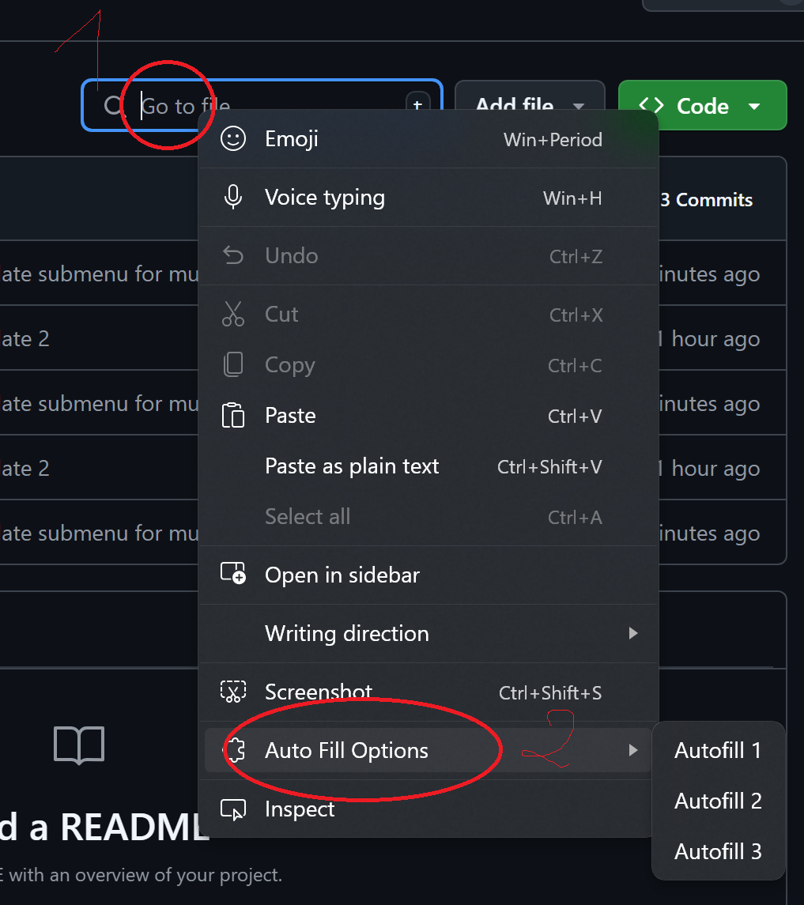 
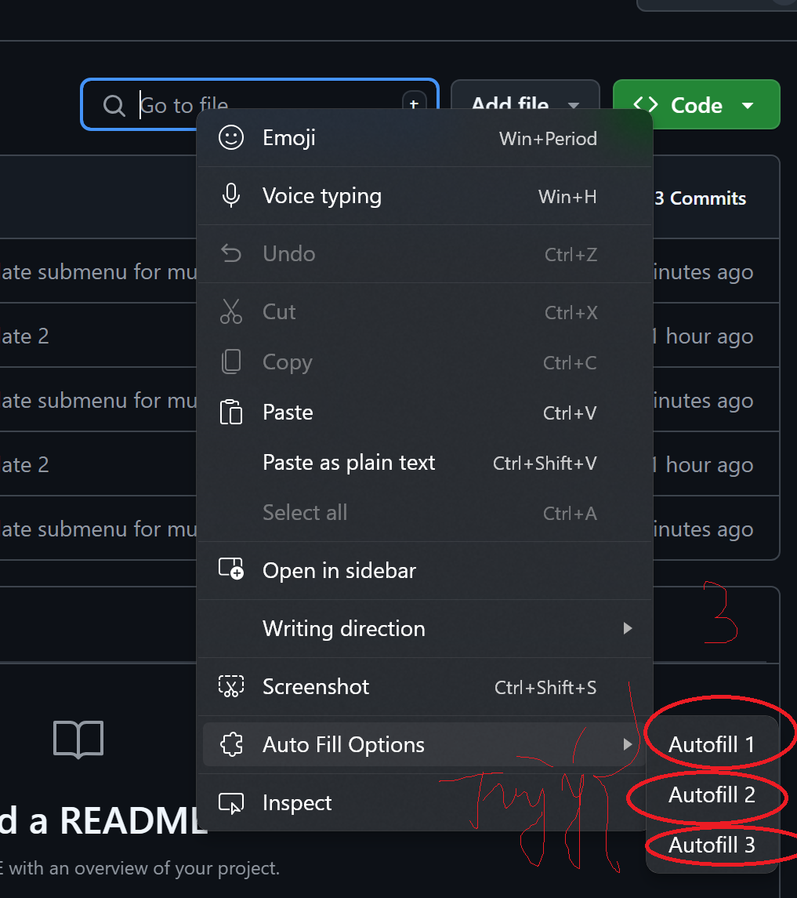 

<h4>2. Dễ dàng thay đổi nội dung text cần tự động điền (trong file data.json):</h4>
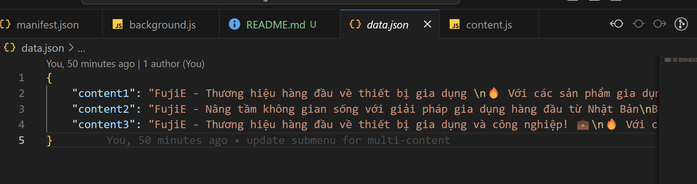 

## MÔ TẢ KĨ THUẬT

- Khi click vào bất kỳ trường input hoặc textarea nào, content.js sẽ lắng nghe và lưu thông tin về trường đó.
- Sau đó, khi click chuột phải tại vị trí đó để gọi trình menu ngữ cảnh -> lựa chọn các nội dung khác nhau (do cá nhân đã cấu hình) tại các sub-menu (menu con) được xổ ra.
- Và cuối cùng, tại pop-up trình menu ngữ cảnh, khi trỏ chuột vào mục "Tự động điền dữ liệu" và lựa chọn các mục mong muốn, extension sẽ lấy dữ liệu từ file JSON và điền vào trường đã được focus trước đó.

<h2>YÊU CẦU TRƯỚC KHI CÀI ĐẶT EXTENSION</h2>

Yêu cầu duy nhất: phải sử dụng trình duyệt Chromium (danh sách trình duyệt Chromium - xem lại ở trên. Ví dụ: Google Chrome, Microsoft Edge, Brave, Opera, ...) - do khai báo của Extension chỉ hỗ trợ những trình duyệt này. Không sử dụng được với Safari / Firefox / Internet Explorer cũ

- Tải xuống source tại địa chỉ https://github.com/TrHgTung/autofill-share-home-tool, sau đó giải nén và ghi nhớ vị trí thư mục chứa source

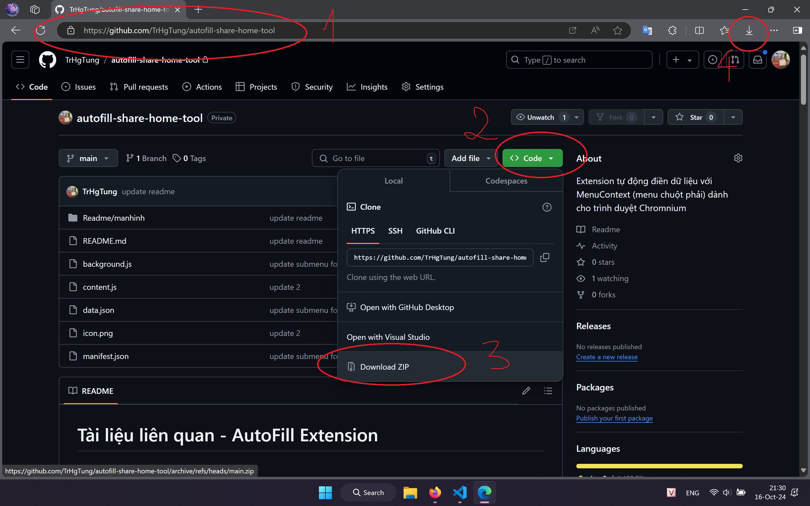 

- Thay đổi các nội dung cần thiết trong file data.json (Tùy biến)

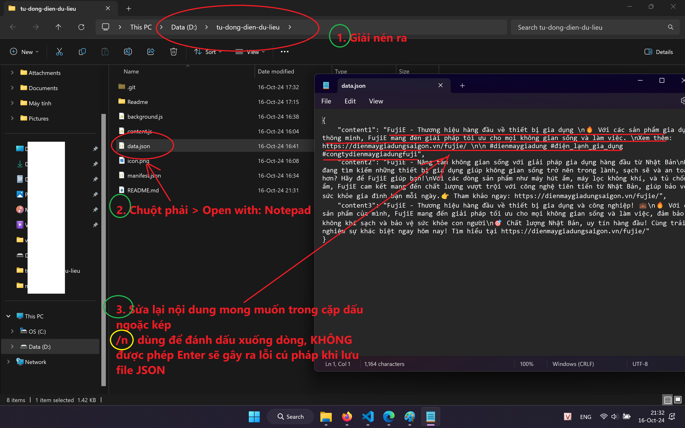 

 
<h2>CÁCH CÀI ĐẶT EXTENSION VÀO TRÌNH DUYỆT</h2>

- Bước 1: Vào cài đặt của trình duyệt (tùy vào từng trình duyệt khác nhau thì cách truy cập Settings cũng khác nhau) -> Quản lý tiện ích mở rộng (Extension) -> Tải các phần mở rộng chưa được đóng gói (Load unpacked)
  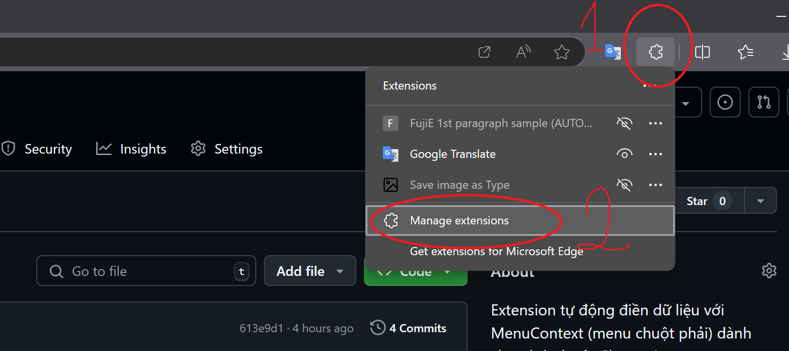 
  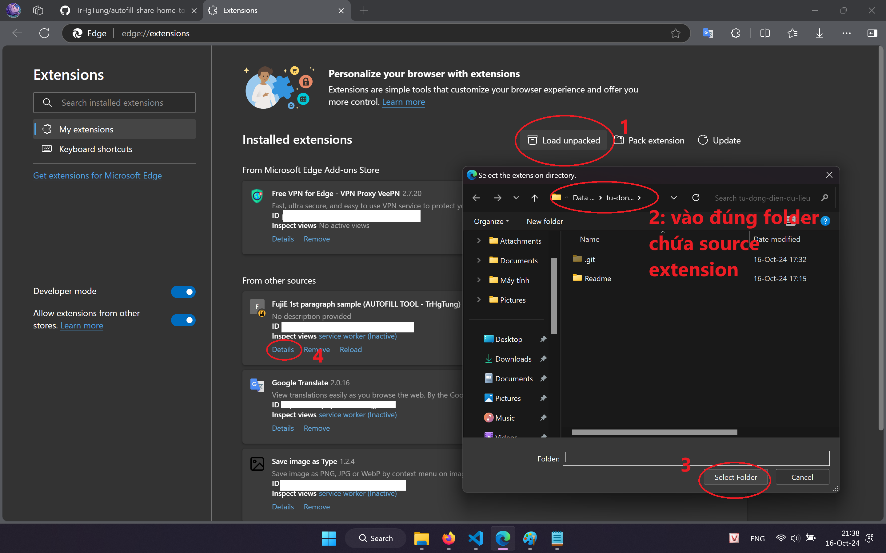

- Bước 2: Trong cửa sổ Explorer hỏi chọn thư mục: Chọn folder chứa source của Extension và Import vào
  

- Bước 3: Ở phần thông tin extension: Chọn Xem chi tiết (Details) Cho phép chạy toàn quyền & chạy ở chế độ duyệt web riêng tư
  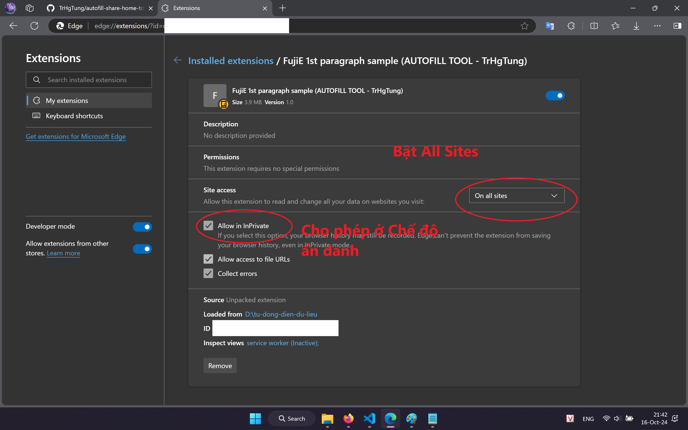

<h2>CÁCH SỬ DỤNG EXTENSION</h2>

Trỏ chuột đến các trường cho phép nhập liệu -> Nhấn chuột phải để mở menu context -> Auto Fill Options -> lựa chọn tùy ý Autofill 1 / 2 hoặc 3 hoặc nhiều lựa chọn hơn (cái này do tự cấu hình)

 

<h2>CÁCH TÙY BIẾN DỮ LIỆU TỰ ĐỘNG ĐIỀN</h2>

> Thực hiện theo trình tự từng bước

1. Trong file data.json: Thêm các giá trị content4, content5,...  

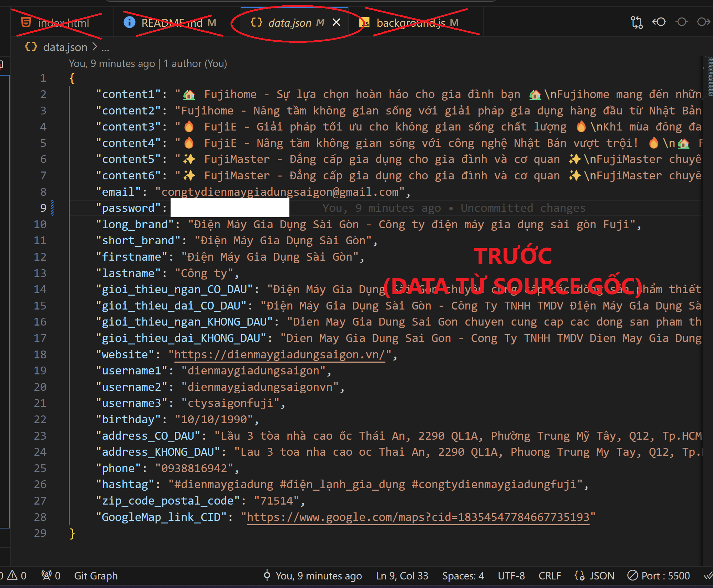 
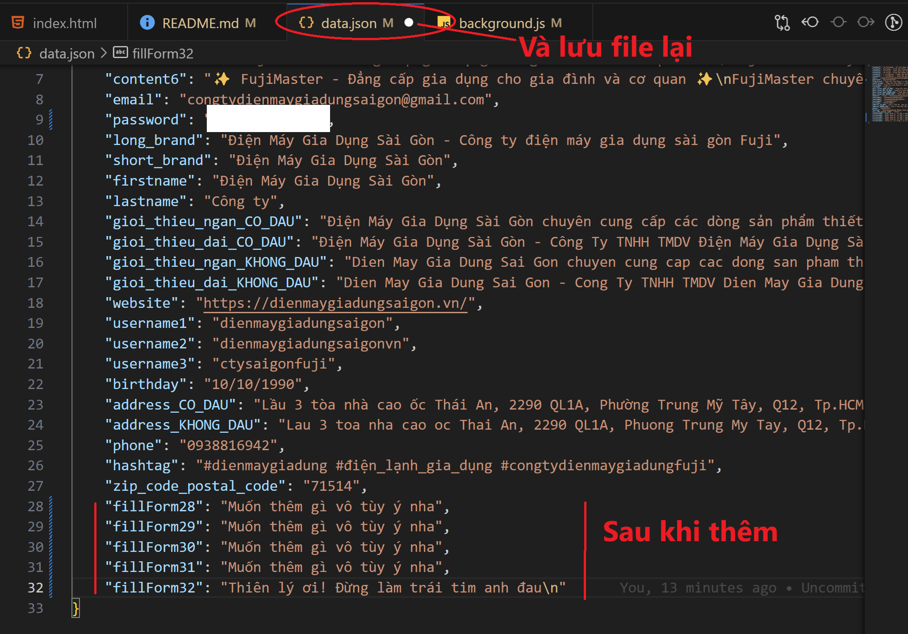 

2. Trong file background.js: Bỏ comment tất cả các dòng bắt đầu bằng hai dấu xẹt //
   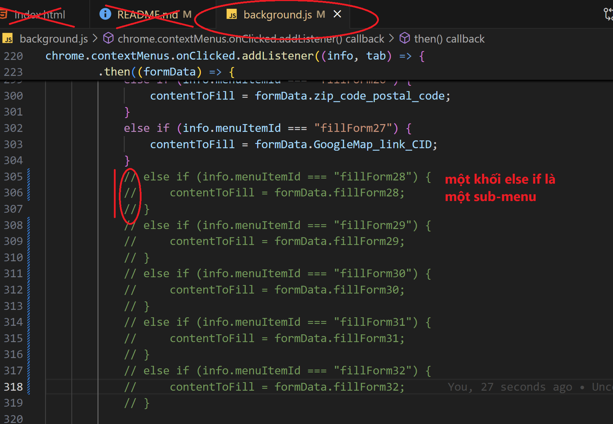 

3. Lưu ý: Mỗi một data phải nằm trên cùng 1 dòng của file data.json, không được Enter. Ví dụ nếu muốn lưu cả một bài văn có chứa các đoạn phải xuống dòng, thì ta lưu trữ thay thế các phím Enter thành ký tự \n để biểu thị cho việc xuống dòng, ký tự \t để biểu thị cho việc nhấn nút tab (thụt lề)  

   Ví dụ: ta muốn lưu một data mới, tại fillForm29. Thì kết quả dữ liệu được trong file data.json sẽ là: 

   > {
   > "......": "...........",
   > "fillForm29": "Đây là dòng đầu tiên\nCòn đây là dòng thứ hai\n\tCòn đây là dòng cuối cùng nhưng được thụt vào một xíu"
   > }

 
Và kết quả đoạn text được in ra trường input khi chọn từ menu ngữ cảnh cho fillForm29, sẽ là:  

> Đây là dòng đầu tiên  Còn đây là dòng thứ hai  > &nbsp;&nbsp;Còn đây là dòng cuối cùng nhưng được thụt vào một xíu

 
    
